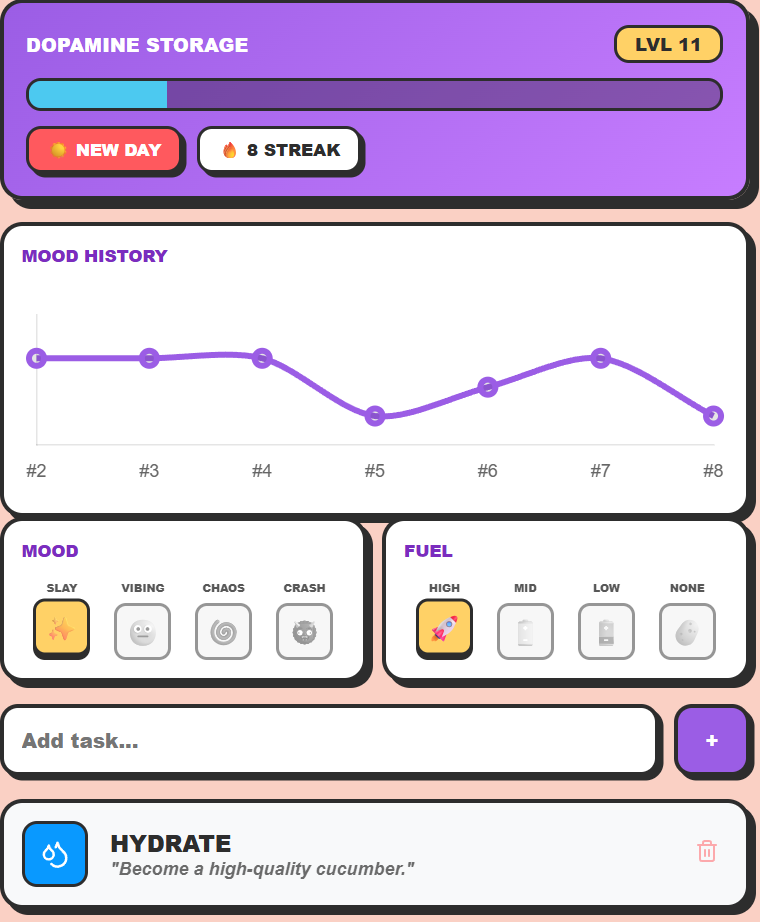
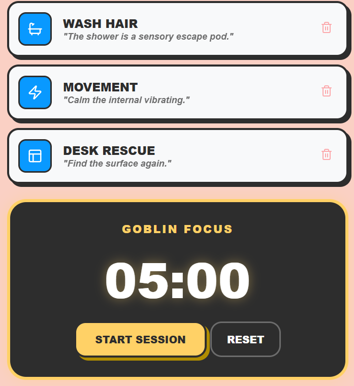

# 🌀 ADHD Chaos Coordinator
A dopamine-first task manager built to help neurodivergent brains navigate executive dysfunction through gamification and sensory cues.

## ✨ Features
* **Dopamine Storage (XP System):** Earn 20 XP per task. Levels are permanent because your progress shouldn't reset just because the sun went down.
* **Mood-Based UI:** Change the entire app's atmosphere based on your current vibe (Slay, Meh, Chaos, or Gremlin).
* **Goblin Mode Timer:** A high-intensity 5-minute focus tool for "just starting" the things you're avoiding.
* **Executive Function Friendly:** One-click "New Day" reset that clears tasks but preserves your hard-earned Level and XP.
* **Sensory Feedback:** Audio cues and smooth CSS transitions to keep the brain engaged.

## 🛠️ Tech Stack
* **HTML5** (Structure)
* **CSS3** (Custom properties & smooth transitions)
* **JavaScript** (Local Storage & Logic)
* **Lucide Icons** (Visual cues)

## 📸 How it Works

1. **Check-in:** Set your mood and energy level to adjust the background color.
2. **Conquer:** Add tasks and click them to earn XP.
3. **Level Up:** Every 5 tasks (100 XP) bumps you to a new level.
4. **Repeat:** Use the "Start New Day" button to wipe the slate clean without losing your RPG-style progress.

## 🚀 Installation
1. Clone this repository.
2. Open `index.html` in any modern web browser.
3. No build steps required—pure vanilla goodness.

## 💾 Local Storage
This app uses `localStorage` to keep your habits, XP, and levels saved directly in your browser. No account required, no data leaves your machine.